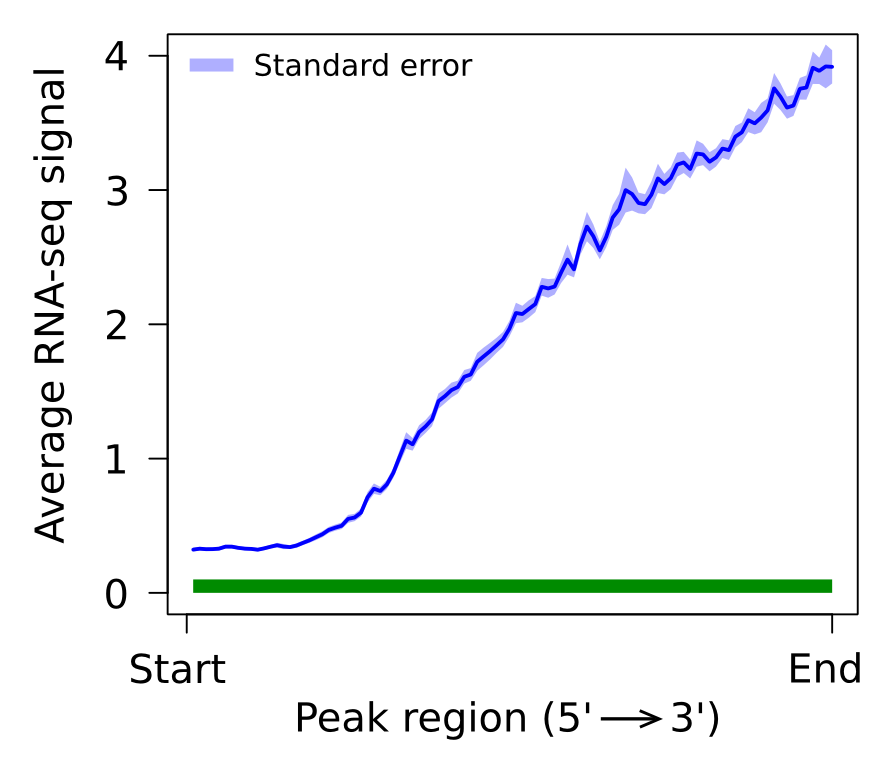

```{r style, echo = FALSE, results = 'asis'}
BiocStyle::markdown()
```

```{r global_options, include = FALSE}
knitr::opts_chunk$set(prompt = TRUE, collapse = TRUE, fig.align = "center")
```

# Introduction
An ever-growing variety of short read RNA sequencing methods is available to
study the various aspects of transcript biosynthesis, processing and 
degradation [@Wang]. Some methods, such as mRNA sequencing (mRNA-seq), 
measure signals derived from processed mRNA and are thus ideally suitable for 
steady-state mature transcript level measurements and for the investigation of 
splice variants [@Morozova]. Other techniques, such as Global Run-On 
sequencing (GRO-seq), nuclear RNA-seq (nucRNA-seq) and chromatin-associated 
RNA-seq (chrRNA-seq) provide information on primary transcription and give a more 
comprehensive picture of transcriptional activity, also for non-polyadenylated 
RNA [@Mitchell; @Werner; @Hah_GR; @Gaidatzis]. The differences in the RNA types 
being sequenced have an impact on the resulting sequencing profiles. mRNA-seq data 
is enriched with reads derived from exons, while GRO-, nucRNA- and chrRNA-seq 
demonstrate a substantial broader coverage of both exonic and intronic regions 
[@Zaghlool]. The presence of intronic reads in GRO-seq type of data makes it 
possible to use it to computationally identify and quantify all *de novo* 
continuous regions of transcription distributed across the genome. This type of 
data, however, is more challenging to interpret and less common practice compared 
to mRNA-seq. One of the challenges for primary transcript detection concerns the 
simultaneous transcription of closely spaced genes, which needs to be properly 
divided into individually transcribed units. The R package `r Biocpkg("transcriptR")` 
combines RNA-seq data with ChIP-seq data of histone modifications that mark active 
Transcription Start Sites (TSSs), such as, H3K4me3 or H3K9/14Ac to overcome this 
challenge. The advantage of this approach over the use of, for example, gene 
annotations is that this approach is data driven and therefore able to deal also 
with novel and case specific events. Furthermore, the integration of ChIP- and 
RNA-seq data allows the identification all known and novel active transcription 
start sites within a given sample.

`r Biocpkg("transcriptR")` is an R package with a pipeline that is made up out 
of two main parts; an RNA-seq and a ChIP-seq part, of which the outputs are 
integrated to ultimately yield a comprehensive database of *de novo* identified 
primary transcripts and their abundance (Figure 1). In the first (RNA-seq) part, 
strand-specific GRO-seq, nucRNA-seq or chrRNA-seq short-reads in Binary Sequence 
Alignment Map (BAM) format are converted to coverage profiles. Background noise 
levels are estimated from regions with the low reads coverage using a Poisson-based
approach. Genomic regions with read densities above background levels are considered
to be expressed and small gaps in otherwise continuously transcribed regions are 
bridged when the gaps sizes are below a certain threshold which is extrapolated 
from the sequencing data and reference gene annotations. The second part, operates
on ChIP-seq data and requires two input files: 1) a BAM file with the sequencing 
reads and 2) a peak file - output of a peak calling algorithm 
(for example MACS2) [@Zhang]. As a first step, a classification model, based on 
the logistic regression, is used to predict and discriminate gene associated peaks 
from background peaks, using estimated characteristics of the peaks. Next, 
transcription initiation within a peak region is investigated by comparing RNA-seq 
read densities upstream and downstream of empirically determined transcription 
start sites. Putative transcription of both forward and reverse genomic strands 
is tested and the results are stored with each ChIP-seq peak.

At the end of the pipeline, both parts are combined and, where applicable,
closely spaced transcripts are divided into individually transcribed units using
the detected active transcription start sites. Additionally, the read count and
FPKM value is calculated for each transcript in the dataset to facilitate
further quantitative analysis.

The advantage of the two-part approach presented here is that the transcript 
detection and quantification can still be performed even in the absence of 
ChIP-seq data, bearing in mind that some adjacent transcripts may be detected as 
one transcribed unit.


In addition to the features mentioned above `r Biocpkg("transcriptR")` provides
functions for generating BigWig, BedGraph and BED files for the visualization of 
the coverage profiles, identified transcripts and peaks predictions in the 
[UCSC genome browser](https://genome.ucsc.edu/).

# Getting started
The `r Biocpkg("transcriptR")` package is available in the `Bioconductor` and can 
be downloaded as follows:
```{r eval = FALSE}
if (!requireNamespace("BiocManager", quietly=TRUE))
    install.packages("BiocManager")
BiocManager::install("transcriptR")
```

```{r eval = TRUE, echo = FALSE, message = FALSE}
library(transcriptR)
```

The following packages are required for the `r Biocpkg("transcriptR")` workflow.
```{r cache = FALSE, echo = TRUE, results = 'hide', message = FALSE}
library(GenomicFeatures)
library(TxDb.Hsapiens.UCSC.hg19.knownGene)
# Use UCSC genes as the reference annotations
knownGene <- TxDb.Hsapiens.UCSC.hg19.knownGene
# Extract genes information
knownGene.genes <- genes(knownGene)
``` 

# Transcripts detection

## TranscriptionDataSet object construction
The workflow is initiated by creating a \Rclass{TranscriptionDataSet} object,
which is a container for holding processed sequencing data and the results of
all downstream analyses. A function \Rfunction{constructTDS} initializes the 
construction of the \Rclass{TranscriptionDataSet} object, by providing the paths
to the input files and information relevant to the library preparation procedure. 
Optionally, the extracted reads can be limited to a specific genomic region, by 
using the `region` option. This would decrease the run time for the downstream 
analyses and might be useful for the testing purposes.

In this tutorial we supply an already constructed \Rclass{TranscriptionDataSet},
containing nuclear RNA-seq data for human chromosome 15, profiled in prostate 
cancer LNCaP cells.
```{r, cache = FALSE}
# load TranscriptionDataSet object
data(tds)
# view TranscriptionDataSet object
tds
```

```{r, eval = FALSE}
# or initialize a new one (do not run the following code)
# specify a region of interest (optional)
region <- GRanges(seqnames = "chr15", ranges = IRanges(start = 63260000, end = 63300000))
# object construction
tds <- constructTDS(file = path.to.Bam,
                    region = region,
                    fragment.size = 250,
                    unique = FALSE,
                    paired.end = FALSE,
                    swap.strand = TRUE)
```

Some of the supplied information can already be seen in the constructed
\Rclass{TranscriptionDataSet} object, whereas other slots are still empty and
will be filled once the analysis is conducted. 

## Expression background estimation
Gene expression is a stochastic process, which often results in substantial
expression noise. To obtain a putative set of transcribed regions, it is
necessary to identify those regions that are expressed significantly above the 
background level. Using a Poisson-based approach for estimating the noise 
distribution, \Rfunction{estimateBackground} function returns a coverage cutoff 
value for a specific 
[False Discovery Rate (FDR)](https://en.wikipedia.org/wiki/False_discovery_rate). 
The estimated value is stored in the `coverageCutoff` slot of the
\Rclass{TranscriptionDataSet} and will be used in the downstream analysis.
```{r}
estimateBackground(tds, fdr.cutoff = 0.01)
# view estimated cutoff value
tds
```


## Coverage profile visualization
RNA-seq coverage profiles for both forward and reverse DNA strand can be 
visualized separately in the   
[UCSC genome browser](https://genome.ucsc.edu/) using \Rfunction{exportCoverage}.
This function can generate tracks in 
[BigWig](http://genome.ucsc.edu/goldenpath/help/bigWig.html) and 
[bedGraph](http://genome.ucsc.edu/goldenpath/help/bedgraph.html) formats, 
which can be uploaded to the genome browser as custom tracks. There is an
option to filter coverage profiles by a coverage cutoff value, either
estimated for a specific FDR via \Rfunction{estimateBackground} or a user
specified value. By default, the coverage cutoff value stored in the
\Rclass{TranscriptionDataSet} object is used. In order to make an informed 
decision about a proper FDR level, it is useful to explore the output at 
different FDR levels and determine the optimal cutoff value. Additionally, RPM 
(reads per million mapped reads) normalization is available.

```{r eval = FALSE}
# look at the coverage profile of the regions expressed above the background level
exportCoverage(object = tds, file = "plus.bw", type = "bigWig", strand = "+",
               filter.by.coverage.cutoff = TRUE, rpm = FALSE)

# or check the raw coverage (all expressed regions)
exportCoverage(object = tds, file = "plus_raw.bw", type = "bigWig", strand = "+", 
               filter.by.coverage.cutoff = FALSE, rpm = FALSE)
```


## Parametres tuning
The ultimate goal of `r Biocpkg("transcriptR")` is to identify continuous 
regions of  transcription. However, in some areas of the genome it is not 
possible to detect transcription, because of the presence of the low mappability
regions and (high copy number) repeats. Sequencing reads can not be uniquely 
mapped to these positions, leading to the formation of gaps in otherwise 
continuous coverage profiles and segmentation of transcribed regions into 
multiple smaller fragments. The gap distance describes the maximum allowed 
distance between adjacent fragments to be merged into one transcript. To choose 
the optimal value for the gap distance, the detected transcripts should largely 
be in agreement with available reference annotations. To accomplish this, the 
function is build on the methodology proposed by 
[Hah et al.](http://www.sciencedirect.com/science/article/pii/S009286741100376X)
[@Hah_Cell]. In brief, this method uses two types of errors:

* 'dissected' error - the ratio of annotations that is segmented into two or more 
   fragments.
   
* 'merged' error - the ratio of non-overlapping annotations that merged by 
   mistake in the experimental data.
   
There is an interdependence between two types of errors. Increasing the gap 
distance decreases the 'dissected' error, by detecting fewer, but longer 
transcripts, while the 'merged' error will increase as more detected transcripts
will span multiple annotations. The gap distance with the lowest sum of two 
error types is chosen as the optimal value.

The function \Rfunction{estimateGapDistance} uses increasing gap distances 
(based on the supplied vector) and calculates the associated error rates to 
determine the optimal gap distance. 
```{r}
# create a range of gap distances to test
# from 0 bp to 10000 bp with the step of 100 bp
gd <- seq(from = 0, to = 10000, by = 100)
estimateGapDistance(object = tds, annot = knownGene.genes, filter.annot = TRUE, 
                    fpkm.quantile = 0.25, gap.dist.range = gd)
# view the optimal gap distance minimazing the sum of two errors
tds
```

Additionally, all intermediate calculations can be accessed by
\Rfunction{getTestedGapDistances} and the output can be presented in a graphical
way by \Rfunction{plotErrorRate} function call. Here, the tested gap distances 
are plotted on the x-axis and corresponding error rates on the y-axis. Three 
curved lines depict the two error types calculated by 
\Rfunction{estimateGapDistance} and the sum of both errors. The vertical dashed 
line depicts the gap distance with the smallest sum of two errors.
```{r fig.cap = "Gap distance error rate.", fig.height=5, fig.width=5}
# get intermediate calculation 
gdTest <- getTestedGapDistances(tds)
head(gdTest)
# plot error rates
plotErrorRate(tds, lwd = 2)
```


## Transcript calling
Transcript detection is performed by \Rfunction{detectTranscripts}. This function
uses the two previously determined parameters to identify transcribed regions: 
`coverage.cutoff` and `gap.dist` as calculated by the \Rfunction{estimateBackground} 
and \Rfunction{estimateGapDistance}, respectively and stored in the 
\Rclass{TranscriptionDataSet} object. Alternatively, the user
may specify his/her own values to be passed to the function. By increasing the
`gap.dist`, fewer transcripts of longer size will be identified, and an increase
in the `coverage.cutoff` will result in fewer transcripts of shorter size.
```{r}
detectTranscripts(tds, estimate.params = TRUE)
```

If desired, the identified transcripts can be associated with the available 
reference annotations based on the genomic overlap. To achieve this, the minimal 
proportion of the overlap between transcript and annotation is controlled by the 
`min.overlap` argument.
```{r}
annotateTranscripts(object = tds, annot = knownGene.genes, min.overlap = 0.5)
```

The detected transcripts can be retrieved by the \Rfunction{getTranscripts}. This
function uses a number of arguments that control the resulting list of reported
transcripts. In case, ChIP-seq data is not available, the following method
will generates the final set of transcripts.
```{r}
trx <- getTranscripts(tds, min.length = 250, min.fpkm = 0.5) 
head(trx, 5)
```


## Detected transcripts visualization
A convenient graphical way to explore the identified transcripts is to visualize 
them in the [UCSC genome browser](https://genome.ucsc.edu/). The 
\Rfunction{transcriptsToBed} function returns a file in 
[BED](https://genome.ucsc.edu/FAQ/FAQformat.html#format1) format, which can be 
directly uploaded to the genome browser. To improve the visual perception, 
transcripts are color-coded by DNA strand orientation.

```{r eval = FALSE}
transcriptsToBed(object = trx, file = "transcripts.bed", strand.color = c("blue", "red"))
```


# ChIP-seq peaks characterization and classification
When associated ChIP-seq data (e.g. H3K4me3 or H3K9ac) is available, this 
information can be used to identify the transcript starts. This is particularly 
useful in situations where genes are densely packed in the genome and the 
identification of individual transcripts from RNA-seq data is challenging. The 
inclusion of ChIP-seq peak information has to be performed carefully as not all 
identified peaks show evidence of active transcription in RNA-seq data. In order 
to discriminate between peaks with active transcription and background peaks, 
we use a two step approach. First, we collect the characteristics of ChIP-seq 
peaks that overlap transcription start sites of annotated genes. These 
characteristics are used to identify all putatively gene-associated ChIP-seq 
peaks. A schematic overview of the procedure is shown in Figure 3. 


Secondly, we incorporate RNA-seq data to find direct evidence of active 
transcription from every putatively gene-associated peak. In order to do this, 
we determine the "strandedness" of the ChIP-seq peaks, using strand specific 
RNA-seq data. The following assumptions are made in order to retrieve the peak 
"strandedness": 

* The putatively gene-associated ChIP-seq peaks are commonly associated with 
  transcription initiation.

* This transcription initiation occurs within the ChIP peak region.

* When a ChIP peak is associated with a transcription initiation event, we 
  expect to see a strand-specific increase in RNA-seq fragment count downstream
  the transcription initiation site (Figure 4).



Each peak in the data set is tested for association with transcription 
initiation on both strands of DNA. A detailed overview of the procedure is 
depicted in the Figure 5. Steps 1-5 are performed for both forward and reverse 
DNA strand separately and step 6 combines the data from both strands. If the 
peak is identified as associated with the transcription on both strands, than 
it is considered to be a bidirectional.

ChIP peak "strandedness" prediction steps:

1. Identify a location within the ChIP-seq peak near the transcription start 
   site. This is accomplished by calculating the cumulative distribution of 
   RNA-seq fragments within a peak region. The position is determined where 
   90% of RNA-seq fragments are located downstream. This approach performs 
   well on both gene-poor and gene-dense regions where transcripts may overlap.
   
2. Two equally sized regions are defined (q1 and q2), flanking the position 
   identified in (1) on both sides. RNA-seq fragments are counted in
   each region.
   
3. ChIP peaks with an RNA-seq fragment coverage below an estimated threshold 
   are discarded from the analysis.
   
4. The probability is calculated for RNA-seq fragments to be sampled from either 
   q1 or q2. Based on the assumptions we stated above, a ChIP peak that is 
   associated with transcription initiation should have more reads in q2 (downstream 
   of the transcription start position) compared to q1, and subsequently, the 
   probability of a fragment being sampled from q2 would be higher.
   
5. ChIP-seq peaks are divided into gene associated and background based on the
   prediction.
   
6. Iteratively, the optimal P(q2) threshold is identified, which balances out the 
   False Discovery Rate (FDR) and False Negative Rate (FNR). Peaks with the P(q2) 
   exceeding the estimated threshold are considered to be associated with the 
   transcription initiation event.


## ChipDataSet object construction
We start ChIP-seq analysis by creating a \Rclass{ChipDataSet} object, which is
a container for storing ChIP-seq peaks information and all the results that will
be generated by applying specific functions. The function \Rfunction{constructCDS}
initializes the \Rclass{ChipDataSet} object, by providing the paths to the input
files and information relevant to the ChIP-seq library preparation procedure.
During the object construction the following steps are executed:

* The peak information is converted into the object of \Rclass{GRanges} class.

* The genomic distribution of the peaks is evaluated (exonic, intronic, intergenic,
  TSSs).

* Each peak in the data set is functionally characterized (peak length, total 
  number of reads, pileup, etc.). The estimated features are used to predict which 
  of the peaks are gene associated in the analysis downstream.

As many peak-calling algorithms tend to divide broader peaks into the several narrower
closely spaced peaks, it is advised to merge these end-to-end peaks to decrease the 
number of false positives and prevent unnecessary truncation of transcripts in the 
downstream analysis.

In this tutorial we supply an already constructed \Rclass{ChipDataSet}, containing
H3K4me3 active histone mark ChIP-seq peaks from the chromosome 15, profiled in
the prostate cancer LNCaP cells.
```{r, cache = FALSE}
# load ChipDataSet object
data(cds)
cds
```

```{r, eval = FALSE}
# or initialize a new one (do not run the following code)
# specify the region of interest (optional)
region <- GRanges(seqnames = "chr15", ranges = IRanges(start = 63260000, end = 63300000))
# object construction
cds <- constructCDS(peaks = path.to.peaks,       # path to a peak file
                    reads = path.to.reads,       # path to a Bam file with reads
                    region = region,
                    TxDb = knownGene,            # annotation database to evaluate
                                                 # genomic distribution of the peaks
                    tssOf = "transcript",        # genomic feature to extract TSS region
                    tss.region = c(-2000, 2000), # size of the TSS region,
                                                 # from -2kb to +2 kb
                    reduce.peaks = TRUE,         # merge neighboring peaks
                    gapwidth = 500,              # min. gap distance between peaks
                    unique = TRUE,
                    swap.strand = FALSE)
```

The peaks stored in \Rclass{ChipDataSet} can be retrieved by a simple
\Rfunction{getPeaks} function call.
```{r eval = TRUE}
peaks <- getPeaks(cds)
head(peaks, 3)
```

A simple quality check of the supplied ChIP-seq peaks can be performed by 
investigating their genomic distribution. Ideally, these peaks should demonstrate 
substantial enrichment at TSS regions. Enrichment of the peaks at a given genomic 
feature (e.g. TSS) is defined as the ratio between the observed and expected number 
of peaks. The expected number of peaks is calculated from the proportion of the 
genome covered by the given genomic feature.
```{r cache = FALSE}
getGenomicAnnot(cds)
```

Additionally, the genomic distribution of the peaks can be visualized in two ways, 
either by observing the total number of peaks overlapping given genomic feature 
(Figure 6) or by looking at the enrichment levels (Figure 7). 
```{r, fig.cap = "Genomic distribution of the peaks", fig.height=5, fig.width=5}
plotGenomicAnnot(object = cds, plot.type = "distr")
```

```{r, fig.cap = "Enrichment of peaks at distinct genomic features.", fig.height=5, fig.width=5}
plotGenomicAnnot(object = cds, plot.type = "enrich")
```


## Prediction of the gene associated peaks
In order to discriminate between functional or gene associated peaks and
non-functional or background peaks, each peak in the data set is characterized
by several features. Among them:

* `length` - the length of a peak (in base pairs).

* `fragments` - total number of fragments overlapping a peak region.

* `density` - number of fragments per base pair of the peak length.

* `pileup` - highest fragment pileup in each peak region.

* `tssOverlap` - overlap (binary, yes/no) of the peak with the annotated
    TSS region.

Moreover, the user may wish to supply her/his own list of features with the
\Rfunction{addFeature}. See the manual page for an example of the use of
\Rfunction{addFeature}.

Prior to fitting the logistic model, the relations between predictors and 
response variable (`tssOverlap`) can be explored with \Rfunction{plotFeatures}
(Figure 8). Based on the plots, poor predictors can be excluded from the
analysis to improve the model fit. In general, the `pileup` (peak height) is a 
good predictor on its own, as it can segregate gene associated and background peaks
very well.
```{r eval = TRUE, fig.cap = "Estimated features", fig.height = 4, fig.width = 8}
plotFeatures(cds, plot.type = "box")
```

The logistic regression model fit is accomplished by
\Rfunction{predictTssOverlap}. In order to improve the accuracy of the model the 
data is internally partitioned into a training and testing data sets. The 
percent of the data that will be allocated to the training set should be 
specified by parameter `p`. A repeated 10-Fold Cross-Validation is used to 
calculate performance measures on the training data set and to prevent 
over-fitting. It is possible to specify a subset of features (predictors) to be 
used in the model fit via the `feature` argument. By default, all the features will 
be used.
```{r eval = TRUE}
predictTssOverlap(object = cds, feature = "pileup", p = 0.75)
cds
```

The result of the logistic regression model fit, can be viewed by
\Rfunction{getPeaks}. Two new columns have been added to the output:
1) `predicted.tssOverlap.prob` - estimated probability of a peak being gene
associated and 2) `predicted.tssOverlap` - predicted class (binary, yes/no).
```{r}
peaks <- getPeaks(cds)
head(peaks, 3)
```

The detailed overview of the classification model fit to the data and the
significance of each predictor can be accessed by \Rfunction{getConfusionMatrix}
and \Rfunction{getPredictorSignificance} respectively. Features with a high
p-value can be excluded and the analysis should be rerurn with the significant 
predictors only.
```{r eval = TRUE}
getConfusionMatrix(cds)
getPredictorSignificance(cds)
```

Additionally, the performance of the model can be visualized by a
[Receiver operating characteristic](https://en.wikipedia.org/wiki/Receiver_operating_characteristic)
(ROC) plot (Figure 9). The curve is created by plotting the true positive rate
(sensitivity) against the false positive rate (1 - specificity) at various
threshold settings. The closer the curve follows the left-hand border and then
the top border of the ROC space, the more accurate the test. The area under the
curve (AUC) is a measure of accuracy.
```{r, fig.cap="Performance of the classification model (gene associated peaks prediction).", eval = TRUE, fig.width = 4.5, fig.height = 4.5}
plotROC(object = cds, col = "red3", grid = TRUE, auc.polygon = TRUE)
```

## Prediction of the peak strandedness
The Prediction of the peak "strandedness" is accomplished by
\Rfunction{predictStrand}. This function requires information stored in both
\Rclass{ChipDataSet} and \Rclass{TranscriptionDataSet} objects.  
```{r eval = TRUE}
predictStrand(cdsObj = cds, tdsObj = tds, quant.cutoff = 0.1, win.size = 2000)
cds
peaks <- getPeaks(cds)
head(peaks[ peaks$predicted.tssOverlap == "yes" ], 3)
```

The `predicted.strand` can take one of the four possible variants: 1) "+"
plus strand, 2) "-" minus strand, 3) "bi" bidirectional and 4) "." not 
associated with a transcription initiation event. All internal calculations 
performed by \Rfunction{predictStrand} can be viewed by 
\Rfunction{getQuadProb}. It returns a data frame, where each row corresponds to 
a peak and each column keeps one of the intermediate calculations:

* `max.cov` - maximum coverage of the RNA-seq fragments inside the peak region.

* `pass.cov.treshold` - whether the `max.cov` exceeds the `coverage.cutoff`,
   either user defined or estimated from RNA-seq data by
   \Rfunction{estimateBackground} function call and stored in
   \Rclass{TranscriptionDataSet} object.
   
* `q1q2.sepline.coord` - genomic coordinate corresponding to the transcription
   start position inside the peak region and which is used to separate q1 and q2.
   
* `q1.coord` - genomic coordinates of q1.

* `q2.coord` - genomic coordinates  of q2.

* `q1.count` - total number of fragments in q1.

* `q2.count` - total number of fragments in q2.

* `q1.prob` - probability of a fragment being sampled from the q1.

* `q2.prob` - probability of a fragment being sampled from the q2 .

```{r eval = TRUE}
df <- getQuadProb(cds, strand = "+")
head(df, 3)
```

The predicted P(q2) threshold, used to select peaks with a putative 
transcription initiation event, is accessed by \Rfunction{getProbTreshold}.
```{r eval = TRUE}
 getProbTreshold(cds)
```

## Peaks visualization
A convenient way to explore output of the predictions made on the ChIP peaks 
is to visualize them in the [UCSC genome browser](https://genome.ucsc.edu/). 
The \Rfunction{peaksToBed} function returns a file in 
[BED](https://genome.ucsc.edu/FAQ/FAQformat.html#format1) format, which can be 
uploaded directly to the genome browser. To improve the visual perception, 
peaks are color-coded by the predicted strand.
```{r eval = FALSE}
peaksToBed(object = cds, file = "peaks.bed", gene.associated.peaks = TRUE)
```


# Transcript boundaries demarcation
As a last step, both parts of the workflow are combined and, where applicable, 
closely spaced transcripts are divided into individually transcribed units using
the detected active transcription start sites. There is a single function       
\Rfunction{breakTranscriptsByPeaks}, which will generate the final set of 
transcripts.
```{r}
# set `estimate.params = TRUE` to re-calculate FPKM and coverage density
breakTranscriptsByPeaks(tdsObj = tds, cdsObj = cds, estimate.params = TRUE)
# re-annotate identified transcripts
annotateTranscripts(object = tds, annot = knownGene.genes, min.overlap = 0.5)
# retrieve the final set of transcripts
trx.final <- getTranscripts(tds)
```

```{r eval = FALSE}
# visualize the final set of transcripts in a UCSC genome browser
transcriptsToBed(object = trx.final, file = "transcripts_final.bed")
```

We can explore which transcripts are broken by peaks, by simply intersecting 
two sets of transcript outputs (before breaking transcripts by peaks, and after).
```{r}
hits <- findOverlaps(query = trx, subject = trx.final)
trx.broken <- trx[unique(queryHits(hits)[duplicated(queryHits(hits))])]
head(trx.broken, 5)
```

# Session Information
Here is the output of `sessionInfo()` on the system on which this document was
compiled:
```{r echo=FALSE}
sessionInfo()
```


# References
